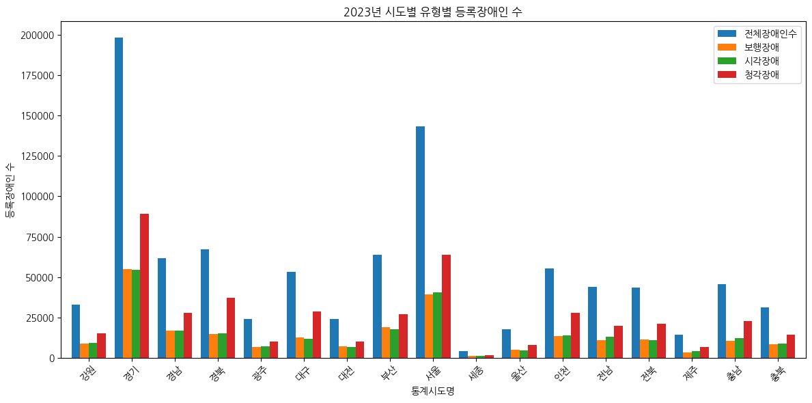

# YongChongMining

2025년도 빅데이터 처리 강의에서 진행한, **도시별 장애인 유형별 현황 및 편의시설 데이터 분석·시각화 프로젝트**

---

## 📊 프로젝트 개요
본 프로젝트는 2013년부터 2023년까지의 장애인 등록 통계 데이터를 활용하여  
도시별(시도 단위) **장애 유형별 현황**과 **10년간 증가율**,  
그리고 **편의시설 설치 현황**을 전처리·분석·시각화한 결과를 보여줍니다.

---

## 📂 프로젝트 구조
```
YongChongMining/
├─ data/                 # 원본 데이터 (CSV, GeoJSON)
│   ├─ mining_1312.csv ~ mining_2312.csv # 연도별 장애인 등록 통계 CSV 파일
│   └─ 법정구역_시도_simplified.geojson # 시도 경계 GeoJson 파일
├─ src/                  # 데이터 처리 및 시각화 스크립트
│   ├─ preprocess.py    # 데이터 전처리 및 가공 스크립트
│   ├─ utils.py         # 공통 함수 및 유틸리티 모듈
│   ├─ viz_bar_counts.py  # 등록수 막대그래프 생성 스크립트
│   ├─ viz_growth_rate.py # 증가율 막대그래프 생성 스크립트
│   ├─ viz_trend_lines.py # 연도별 추이 그래프 생성 스크립트
│   └─ viz_map.py         # 인터랙티브 지도 시각화 스크립트
├─ outputs/              # 시각화 결과물
│   ├─ disabled_count_2023.png    # 2023년 장애유형별 등록수 시각화 이미지
│   ├─ growth_rate_2013_2023.png  # 2013~2232 증가율 시각화 이미지
│   ├─ trend_lines.png            # 연도별 등록 추이 시각화 이미지
│   └─ interactive_map.html       # 인터랙티브 지도 HTML 파일
├─ requirements.txt      # 의존성 패키지 목록
└─ README.md
```

---

## ⚙️ 사용 방법

1. **의존성 설치**
   ```bash
   pip install -r requirements.txt
   ```

2. **전처리 실행**
   ```bash
   python src/preprocess.py
   ```

   실행 후 `outputs/` 폴더에 전처리 결과(`pt23_u.parquet`, `growth.parquet`)가 생성됩니다.

3. **시각화 실행**
   - 등록수 막대그래프:
     ```bash
     python src/viz_bar_counts.py
     ```
   - 증가율 막대그래프:
     ```bash
     python src/viz_growth_rate.py
     ```
   - 연도별 추이 그래프:
     ```bash
     python src/viz_trend_lines.py
     ```
   - 인터랙티브 지도:
     ```bash
     python src/viz_map.py
     ```

   결과물은 `outputs/` 폴더에 저장됩니다.

---

## 🖼️ 시각화 결과 예시

### 2023년 시도별 장애유형별 등록 현황


### 2013→2023 시도별 장애유형별 증가율


### 2013·2018·2023 등록 추이


### 인터랙티브 지도
[👉 결과 보기 (HTML)](outputs/interactive_map.html)

---

## 📑 데이터 출처
- 장애인 등록 통계: 보건복지부 (공공데이터포털 제공)
- 행정구역 경계: [국토지리정보원](http://www.ngii.go.kr) 제공 GeoJSON 단순화 데이터

---
